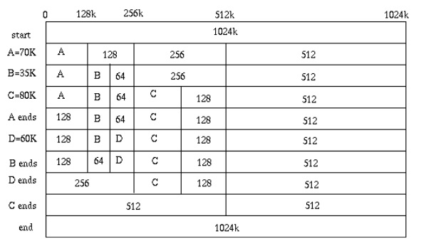
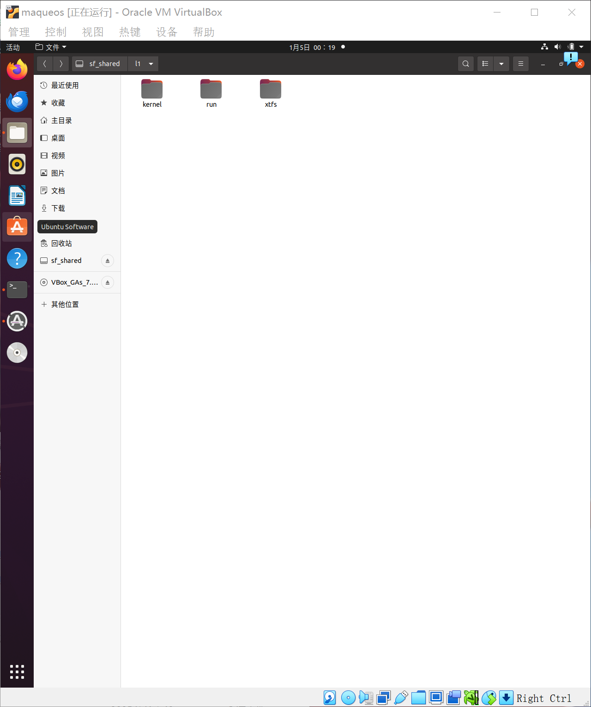
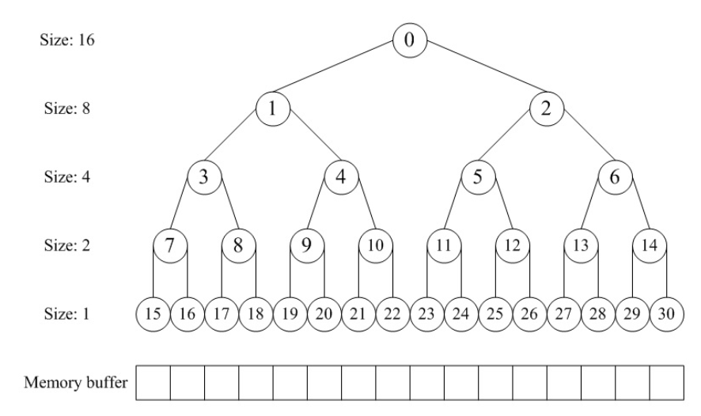

# BUDDY SYSTEM 设计文档

<style>
.center 
{
  width: auto;
  display: table;
  margin-left: auto;
  margin-right: auto;
}
</style>

<p align="center"><font face="黑体" size=2.>小组成员</font></p>

<div class="center">

| 姓名        | 学号 | 班级     |
| :----:       |    :----:   |          :----: |
| 白一含      | 320220941300      | 计算机1班   |
| 杜姝贤   | 320220941430       | 计算机2班     |
| 姜悦   | 320220941630        | 计算机2班      |
| 刘潇文   | 320220941770       | 计算机1班 

</div>

## 目录

***

[一、设计思路](#一设计思路)
[1.理论介绍](#理论介绍)
[(1)分配内存](#分配内存)
[(2)释放内存](#释放内存)
[2.实践介绍](#实践介绍)
[(1)详细设计思路](#详细设计思路)
[(2)参考代码分析](#参考代码分析)
[二、设计实现过程](#二设计实现过程)
[1.代码部分设计解析](#代码部分设计解析)
[(1)buddy结构](#buddy结构)
[(2)初始化](#初始化)
[(3)分配](#分配)
[(4)释放](#释放)
[(5)其它](#其它)
[三、环境安装与配置](#三环境安装与配置)
[1. 安装虚拟机与操作系统](#1-安装虚拟机与操作系统)
[2. 更新源、安装软件、克隆仓库](#2-更新源安装软件克隆仓库)
[四、结果分析](#四结果分析)
[1.运行结果](#运行结果)
[2.测试输出](#测试输出)
[五、源码中应用到的重要函数](#五源码中应用到的重要函数)
[1. 显示器驱动](#1-显示器驱动)
[（1）MaQueOS 显示参数](#1maqueos-显示参数)
[（2）write\_char函数](#2write_char函数)
[（3）con\_init函数](#3con_init函数)
[（4）printk函数](#4printk函数)
[（5）erase\_char函数](#5erase_char函数)
[（6）cr\_lf函数](#6cr_lf函数)
[（7）scrup函数](#7scrup函数)
[（8）del 函数](#8del-函数)
[（9）panic函数](#9panic函数)
[2. 时钟中断](#2-时钟中断)
[（1）excp\_init函数](#1excp_init函数)
[（2）int\_on函数](#2int_on函数)
[（3）exception\_handler函数](#3exception_handler函数)
[（4）\_start函数](#4_start函数)
[（5）do\_exception函数](#5do_exception函数)
[（6）timer\_interrupt函数](#6timer_interrupt函数)
[3. 键盘驱动](#3-键盘驱动)
[（1）main函数](#1main函数)
[（2）mem\_init函数](#2mem_init函数)
[（3）get\_page函数](#3get_page函数)
[（4）free\_page函数](#4free_page函数)
[（5）keyboard\_interrupt函数](#5keyboard_interrupt函数)
[（6）do\_keyboard函数](#6do_keyboard函数)
[（7）print\_debug函数](#7print_debug函数)
[4.页例外](#4页例外)
[(1)do\_no\_page函数](#1do_no_page函数)
[(2)copy\_page\_table函数](#2copy_page_table函数)
[(3)share\_page函数](#3share_page函数)
[(4)do\_wp\_page函数](#4do_wp_page函数)
[(5)is\_share\_page函数](#5is_share_page函数)
[(6)get\_pte函数](#6get_pte函数)
[(7)put\_page函数](#7put_page函数)
[(8)free\_page\_table函数](#8free_page_table函数)

## 一、设计思路

***

### 理论介绍

<div align=left></div>
课本中对于伙伴系统的定义为（P202）
<div align=left></div>
后续又进行了关于懒惰伙伴系统的延展性介绍（P237）
<div align=left></div><div align=left></div>
更详细的来说，伙伴系统在分配内存与释放内存中是这样工作的：
<div align=left></div>
<div align=left></div>

#### 分配内存

寻找大小合适的内存块
（大于等于所需大小并且最接近2的幂，比如需要14，实际分配16）

- 如果找到了，分配给应用程序。
- 如果没找到，分出合适的内存块。而分配方式如下：
    1.对半分离出高于所需大小的空闲内存块
    2.如果分到最低限度，分配这个大小。
    3.回溯到步骤1（寻找合适大小的块）
    4.重复该步骤直到一个合适的块

#### 释放内存

释放该内存块

- 寻找相邻的块，看其是否释放了。
- 如果相邻块也释放了，合并这两个块，重复上述步骤直到遇上未释放的相邻块，或者达到最高上限（即所有内存都释放了）。

### 实践介绍

通过学习了解到buddy system 需要通过二叉树来实现，而这其中显然涉及到各种算法优化，于是在上网查找资料的过程中，看到这样一份设计思路很巧妙的代码[wuwenbin/buddy2](https://github.com/wuwenbin/buddy2)，就以此为本次设计的参考代码。

#### 详细设计思路

通过一个数组形式的完全二叉树来监控管理内存，二叉树的节点用于标记相应内存块的使用状态，高层节点对应大的块，低层节点对应小的块，在分配和释放中通过这些节点的标记属性来进行块的分离合并。如图所示，假设总大小为16单位的内存，我们就建立一个深度为5的满二叉树，根节点从数组下标[0]开始，监控大小16的块；它的左右孩子节点下标[1~2]，监控大小8的块；第三层节点下标[3~6]监控大小4的块……依此类推。<div align=left></div>
在分配阶段，首先要搜索大小适配的块，假设第一次分配3，转换成2的幂是4，我们先要对整个内存进行对半切割，从16切割到4需要两步，那么从下标[0]节点开始深度搜索到下标[3]的节点并将其标记为已分配。第二次再分配3那么就标记下标[4]的节点。第三次分配6，即大小为8，那么搜索下标[2]的节点，因为下标[1]所对应的块被下标[3~4]占用了。

在释放阶段，我们依次释放上述第一次和第二次分配的块，即先释放[3]再释放[4]，当释放下标[4]节点后，我们发现之前释放的[3]是相邻的，于是我们立马将这两个节点进行合并，这样一来下次分配大小8的时候，我们就可以搜索到下标[1]适配了。若进一步释放下标[2]，同[1]合并后整个内存就回归到初始状态。

#### 参考代码分析

数据结构：

```c
struct buddy2 {
  unsigned size;
  unsigned longest[1];
};
```

这里的成员size表明管理内存的总单元数目（测试用例中是32），成员longest就是二叉树的节点标记，表明所对应的内存块的空闲单位，此处数组大小为1表明这是可以向后扩展的（注：在GCC环境下你可以写成longest[0]，不占用空间，这里是出于可移植性考虑），我们在分配器初始化的buddy2_new可以看到这种用法。

```c
struct buddy2* buddy2_new( int size ) {
  struct buddy2* self;
  unsigned node_size;
  int i;

  if (size < 1 || !IS_POWER_OF_2(size))
    return NULL;

  self = (struct buddy2*)ALLOC( 2 * size * sizeof(unsigned));
  self->size = size;
  node_size = size * 2;

  for (i = 0; i < 2 * size - 1; ++i) {
    if (IS_POWER_OF_2(i+1))
      node_size /= 2;
    self->longest[i] = node_size;
  }
  return self;
}
```

整个分配器的大小就是满二叉树节点数目，即所需管理内存单元数目的2倍。一个节点对应4个字节，longest记录了节点所对应的的内存块大小。

内存分配的alloc中，入参是分配器指针和需要分配的大小，返回值是内存块索引。alloc函数首先将size调整到2的幂大小，并检查是否超过最大限度。然后进行适配搜索，深度优先遍历，当找到对应节点后，将其longest标记为0，即分离适配的块出来，并转换为内存块索引offset返回，依据二叉树排列序号，比如内存总体大小32，我们找到节点下标[8]，内存块对应大小是4，则offset = (8+1)*4-32 = 4，那么分配内存块就从索引4开始往后4个单位。

```c
int buddy2_alloc(struct buddy2* self, int size) {
  unsigned index = 0;
  unsigned node_size;
  unsigned offset = 0;

  if (self==NULL)
    return -1;

  if (size <= 0)
    size = 1;
  else if (!IS_POWER_OF_2(size))
    size = fixsize(size);

  if (self->longest[index] < size)
    return -1;

  for(node_size = self->size; node_size != size; node_size /= 2 ) {
    if (self->longest[LEFT_LEAF(index)] >= size)
      index = LEFT_LEAF(index);
    else
      index = RIGHT_LEAF(index);
  }

  self->longest[index] = 0;
  offset = (index + 1) * node_size - self->size;

  while (index) {
    index = PARENT(index);
    self->longest[index] =
      MAX(self->longest[LEFT_LEAF(index)], self->longest[RIGHT_LEAF(index)]);
  }

  return offset;
}
```

在函数返回之前需要回溯，因为小块内存被占用，大块就不能分配了，比如下标[8]标记为0分离出来，那么其父节点下标[0]、[1]、[3]也需要相应大小的分离。将它们的longest进行折扣计算，取左右子树较大值，下标[3]取4，下标[1]取8，下标[0]取16，表明其对应的最大空闲值。

在内存释放的free接口，我们只要传入之前分配的内存地址索引，并确保它是有效值。之后就跟alloc做反向回溯，从最后的节点开始一直往上找到longest为0的节点，即当初分配块所适配的大小和位置。我们将longest恢复到原来满状态的值。继续向上回溯，检查是否存在合并的块，依据就是左右子树longest的值相加是否等于原空闲块满状态的大小，如果能够合并，就将父节点longest标记为相加的和。

```c
void buddy2_free(struct buddy2* self, int offset) {
  unsigned node_size, index = 0;
  unsigned left_longest, right_longest;

  assert(self && offset >= 0 && offset < size);

  node_size = 1;
  index = offset + self->size - 1;

  for (; self->longest[index] ; index = PARENT(index)) {
    node_size *= 2;
    if (index == 0)
      return;
  }

  self->longest[index] = node_size;

  while (index) {
    index = PARENT(index);
    node_size *= 2;

    left_longest = self->longest[LEFT_LEAF(index)];
    right_longest = self->longest[RIGHT_LEAF(index)];

    if (left_longest + right_longest == node_size)
      self->longest[index] = node_size;
    else
      self->longest[index] = MAX(left_longest, right_longest);
  }
}
```

上面两个成对alloc/free接口的时间复杂度都是O(logN)，保证了程序运行性能。然而这段程序设计的独特之处就在于使用加权来标记内存空闲状态，而不是一般的有限状态机，实际上longest既可以表示权重又可以表示状态，状态机就毫无必要了。

查阅介绍博客可知这份代码唯一的缺陷就是longest的大小是4字节，内存消耗大。但 [cloudwu](https://blog.codingnow.com/2011/12/buddy_memory_allocation.html) 的博客上有人提议用logN来保存值，这样就能实现uint8_t大小

clone到本地后进行测试发现存在问题，进行修改，在进行搜索时并不是左子树满足条件就沿着左子树搜索，而是需要判断左右子树的最小值是否满足条件，如果满足则沿着最小值所在子树搜索，否则沿着最大值所在子树进行搜索。

## 二、设计实现过程

***

在设计思路的讨论之后，基于[maque os](https://gitee.com/dslab-lzu/maqueos/tree/master)中的**code12**源码进行伙伴分配器代码的设计和移植（移植过程使用虚拟机与主机的共享文件夹可轻松对改动的文件进行替换）<div align=left></div>

### 代码部分设计解析

#### buddy结构

采用完全二叉树结构来管理连续内存页，如下图buddy system共管理16个连续内存页，每一结点记录与管理若干连续内存页，如结点0管理连续的16个页，结点1管理其下连续的8个页，结点15管理连续内存的第一个页，每个结点存储一个longest，记录该结点所管理的所有页中最大可连续分配页数目。<div align=left></div>

定义buddy的结构如下所示，size表示所管理的连续内存页大小(需要是2的幂)，longest为上面所说的数组，这里是直接以分配物理内存的形式存在(指针)，longest_num_page表示longest数组的大小，free_size表示当前该区域的空闲页大小，begin_page指针指向所管理的连续内存页的第一页的Page结构。
由于可能存在多个可管理的内存区域，因此定义了buddy数组，分别管理num_buddy_zone个内存区域。

```c
struct buddy {
    size_t size;
    uintptr_t *longest;
    size_t longest_num_page;
    size_t total_num_page;
    size_t free_size;
    struct Page *begin_page;
};

struct buddy mem_buddy[MAX_NUM_BUDDY_ZONE];
int num_buddy_zone = 0;
```

#### 初始化

对应原代码中的`mem_init`
buddy_init_memmap用于buddy system的初始化，输入参数base为可管理区域起始页的Page结构，n为页个数。
输入参数参考`maqueos`(宏定义中有)<div align=left></div>
初始化函数完成以下工作

- 将base开始的若干个内存页作为longest数组的存储空间，之后开始的内存页作为可进行分配的物理页。
- 将管理的连续内存页大小设为2的n次幂，再从顶向下初始每一结点的longest。

```c
static void
buddy_init_memmap(struct Page *base, size_t n) {
    cprintf("n: %d\n", n);
    struct buddy *buddy = &mem_buddy[num_buddy_zone++];

    size_t v_size = next_power_of_2(n);
    size_t excess = v_size - n;
    size_t v_alloced_size = next_power_of_2(excess);
```

```c
    buddy->size = v_size;
    buddy->free_size = v_size - v_alloced_size;
    buddy->longest = page2kva(base);
    buddy->begin_page = 
    pa2page(PADDR(ROUNDUP(buddy->longest + 2 * v_size * sizeof(uintptr_t), PGSIZE)));
    buddy->longest_num_page = buddy->begin_page - base;
    buddy->total_num_page = n - buddy->longest_num_page;

    size_t node_size = buddy->size * 2;

    for (int i = 0; i < 2 * buddy->size - 1; i++) {
        if (IS_POWER_OF_2(i + 1)) {
            node_size /= 2;
        }
        buddy->longest[i] = node_size;
    }

    int index = 0;
    while (1) {
        if (buddy->longest[index] == v_alloced_size) {
            buddy->longest[index] = 0;
            break;
        }
        index = RIGHT_LEAF(index);
    }

    while (index) {
        index = PARENT(index);
        buddy->longest[index] = 
        MAX(buddy->longest[LEFT_LEAF(index)], buddy->longest[RIGHT_LEAF(index)]);
    }

    struct Page *p = buddy->begin_page;
    for (; p != base + buddy->free_size; p ++) {
        assert(PageReserved(p));
        p->flags = p->property = 0;
        set_page_ref(p, 0);
    }
}
```

在固定可分配内存大小时，必须是2的n次幂个页，如果向下取幂，则可能会有较大的内存浪费；这里采用向上取幂的方式，对于实际不存在的连续页(取2的n次幂)，将其对应longest进行标记，假设其已经分配过。这样可以充分使用物理页空间。

#### 分配

对应`get_page`模块
分配函数从树根出发寻找合适页数目的空闲块，找到后将其longest设为0，表示此结点对应的连续物理页均被分配，再从该结点出发沿着到树根的路径更新其longest。

```c
static struct Page *
buddy_alloc_pages(size_t n) {
    assert(n > 0);
    if (!IS_POWER_OF_2(n))
        n = next_power_of_2(n);

    size_t index = 0;
    size_t node_size;
    size_t offset = 0;

    struct buddy *buddy = NULL;
    for (int i = 0; i < num_buddy_zone; i++) {
        if (mem_buddy[i].longest[index] >= n) {
            buddy = &mem_buddy[i];
            break;
        }
    }

    if (!buddy) {
        return NULL;
    }
    for (node_size = buddy->size; node_size != n; node_size /= 2) {
        if (buddy->longest[LEFT_LEAF(index)] >= n)
            index = LEFT_LEAF(index);
        else
            index = RIGHT_LEAF(index);
    }
    buddy->longest[index] = 0;
    offset = (index + 1) * node_size - buddy->size;
```

```c
    while (index) {
        index = PARENT(index);
        buddy->longest[index] = MAX

        (buddy->longest[LEFT_LEAF(index)], buddy->longest[RIGHT_LEAF(index)]);
    }

    buddy->free_size -= n;

    return buddy->begin_page + offset;
}
```

#### 释放

对应`free_page`模块
free函数根据所要释放的内存页在管理的内存页中的偏移，从相应树叶开始从底向上寻找当初一次分配的连续物理页，进行释放，同时更新该结点到树根路径上的longest。
此函数的参数n并无实际作用，只为统一接口。

```c
static void
buddy_free_pages(struct Page *base, size_t n) {
    struct buddy *buddy = NULL;

    for (int i = 0; i < num_buddy_zone; i++) {
        struct buddy *t = &mem_buddy[i];
        if (base >= t->begin_page && base < t->begin_page + t->size) {
            buddy = t;
        }
    }

    if (!buddy) return;

    unsigned node_size, index = 0;
    unsigned left_longest, right_longest;
    unsigned offset = base - buddy->begin_page;

    assert(offset >= 0 && offset < buddy->size);
    node_size = 1;
    index = offset + buddy->size - 1;
```

```c
    for (; buddy->longest[index]; index = PARENT(index)) {
        node_size *= 2;
        if (index == 0)
            return;
    }

    buddy->longest[index] = node_size;
    buddy->free_size += node_size;

    while (index) {
        index = PARENT(index);
        node_size *= 2;

        left_longest = buddy->longest[LEFT_LEAF(index)];
        right_longest = buddy->longest[RIGHT_LEAF(index)];

        if (left_longest + right_longest == node_size)
            buddy->longest[index] = node_size;
        else 
            buddy->longest[index] = MAX(left_longest, right_longest);
    }

}
```

#### 其它

next_power_of_2函数求出size的下一个n次幂

```c
static size_t next_power_of_2(size_t size) {
    size |= size >> 1;
    size |= size >> 2;
    size |= size >> 4;
    size |= size >> 8;
    size |= size >> 16;
    return size + 1;
}
```

## 三、环境安装与配置

***

### 1. 安装虚拟机与操作系统

- 虚拟机管理采用virtual box 7.0，系统采用文件要求的Ubuntu 20.04。

<div align=left></div>

查看当前环境的buddy system状态（打开proc文件，使用`cat buddyinfo`命令）
<div align=left></div>

### 2. 更新源、安装软件、克隆仓库

相关命令：

```linux
//更新源
sudo gedit /etc/apt/sources.list

deb https://mirrors.tuna.tsinghua.edu.cn/ubuntu/ 
focal main restricted universe multiverse
deb https://mirrors.tuna.tsinghua.edu.cn/ubuntu/ 
focal-updates main restricted universe multiverse
deb https://mirrors.tuna.tsinghua.edu.cn/ubuntu/ 
focal-backports main restricted universe multiverse
deb https://mirrors.tuna.tsinghua.edu.cn/ubuntu/ 
focal-security main restricted universe multiverse
```

```c
sudo apt update
sudo apt upgrade
//安装软件
sudo apt install libspice-server-dev libsdl2-2.0-0 libfdt-dev 
libusbredirparserdev libfuse3-dev libcurl4 build-essential gcc-multilib 
libpython2.7 libnettle7 git
//克隆仓库
git clone https://gitee.com/dslab-lzu/maqueos.git
```

按照以上命令进行换源安装软件克隆仓库等操作。 查阅资料后队对sources.list进行适当补充，用`more`命令查看sources.list   （**ubuntu20.04对应参数为focal**）<div align=left></div>

进入code*目录中的run，在run目录下，执行以下命令`./run.sh`

运行结果如下：  
<div align=left></div>

**环境配置成功**

## 四、结果分析

***

### 运行结果

修改其它相关文件并拷贝其它code12文件于code13，然后将文件13置于maqueos目录中（里面有cross-tool）进行运行测试
测试命令分别为xtfs文件系统的命令

<div align=left></div>

与MaQueOS手册第11章中的`hello`与`shmem`命令

`create`与`sync`
<div align=left></div>

`write`与`sync`
<div align=left></div>

`destroy`与`sync`
<div align=left></div>

`hello`与`shmem`
<div align=left></div>

**注意：使用`hexdump`时需要加参数规定展示的数据形式，参考 [Linux命令学习总结hexdump](https://www.cnblogs.com/kerrycode/p/5077687.html)**

总结：所写的buddy system能够被正确使用在maque os中

### 测试输出

由于未在文档中查到xtsh可以查找内存分配的cmd，于是移植在之前暑期学习的清华大学OS课程的ucore平台进行测试<div align=left></div>

- ucore OS起源于MIT CSAIL PDOS课题组开发的xv6&jos、哈佛大学开发的 OS161教学操作系统、以及Linux-2.4内核
- [指导文档](https://learningos.cn/uCore-Tutorial-Guide-2024S/)与[lab库](https://github.com/kiukotsu/ucore)

<div align=left></div>

## 五、源码中应用到的重要函数

***

### 1. 显示器驱动

#### （1）MaQueOS 显示参数

 ```c
#define NR_PIX_X 1280
#define NR_PIX_Y 800
#define CHAR_HEIGHT 16
#define CHAR_WIDTH 8
#define NR_CHAR_X (NR_PIX_X / CHAR_WIDTH)
#define NR_CHAR_Y (NR_PIX_Y / CHAR_HEIGHT)
 ```  

MaQueOS使用的显示模式为图形模式（Graphics Mode）。在MaQueOS中，显示参数被定义为宏。

如代码所示，显示器分辨率为1280（NR_PIX_X）×800（NR_PIX_Y），即，总共1280×800=1024000 个像素，每个字符由8（CHAR_WIDTH）×16（CHAR_HEIGHT）的像素点阵组成，这个像素点阵被称为字模（Fonts）。故显示器每行可显示1280÷8=160个字符，总共可显示800÷16=50行。  

#### （2）write_char函数  

 ```c
void write_char(char ascii, int xx, int yy)
{
    char *font_byte;
    int row, col;
    char *pos;
    font_byte = &fonts[(ascii - 32) * CHAR_HEIGHT];
    pos = (char *)(VRAM_BASE + (yy * CHAR_HEIGHT * NR_PIX_X + xx * CHAR_WIDTH) * NR_BYTE_PIX);
```

```c
    for (row = 0; row < CHAR_HEIGHT; row++, font_byte++)
    {
        for (col = 0; col < CHAR_WIDTH; col++)
        {
            if (*font_byte & (1 << (7 - col)))
            {
                *pos++ = 0;
                *pos++ = 0;
                *pos++ = 255;
                *pos++ = 0;
            }
            else
                pos += NR_BYTE_PIX;
        }
        pos += (NR_PIX_X - CHAR_WIDTH) * NR_BYTE_PIX;
    }
}
```  

write_char 函数用于将指定的字符写入显存中指定的位置。具体写入过程如以上代码所示。write_char函数有3个参数，第1个参数为字符的ascii，第2、3个参数为字符显示位置的坐标。  

#### （3）con_init函数  

```c
 void con_init()
{
    x = 0;
    y = 0;
}
```  

MaQueOS 定义了2个全局变量x、y，用于指示下一个显示字符在显示器上的坐标。在con_init函数中,将x和y变量初始化为0，即控制台初始化完成后，第1个显示字符在显示器上的坐标为（0, 0）。  

#### （4）printk函数  

```c
void printk(char *buf)
{
    char c;
    int nr = 0;
    while (buf[nr] != '\0')
        nr++;
    erase_char(x, y);
    while (nr--)
    {
        c = *buf++;
        if (c > 31 && c < 127)
        {
            write_char(c, x, y);
            sum_char_x[y] = x;
            x++;
            if (x >= NR_CHAR_X)
                cr_lf();
        }
        else if (c == 10 || c == 13)
            cr_lf();
        else if (c == 127)
            del();
        else
            panic("panic: unsurpported char!\n");
    }
    write_char('_', x, y);
}
```  

在显示器驱动程序中，printk函数用于将指定的字符串显示到显示器上，显示位置由（x, y）坐标指定。printk函数的参数为需显示字符串的起始地址。具体显示过程如上代码所示。  

#### （5）erase_char函数  

```c
void erase_char(int xx, int yy)
{
    int row, col;
    char *pos;

    pos = (char *)(VRAM_BASE + (yy * CHAR_HEIGHT * NR_PIX_X + xx * CHAR_WIDTH) * NR_BYTE_PIX);
    for (row = 0; row < CHAR_HEIGHT; row++)
    {
        for (col = 0; col < CHAR_WIDTH; col++)
        {
            *pos++ = 0;
            *pos++ = 0;
            *pos++ = 0;
            *pos++ = 0;
        }
        pos += (NR_PIX_X - CHAR_WIDTH) * NR_BYTE_PIX;
    }
}
```  

字符擦除函数erase_char用于擦除显示器上给定坐标（xx, yy）的字符。具体擦除过程如上代码所示。所谓擦除，就是将像素绘制成背景色（黑色）。  

#### （6）cr_lf函数  

```c
void cr_lf()
{
    x = 0;
    if (y < NR_CHAR_Y - 1)
        y++;
    else
        scrup();
}
```  

对回车换行的处理由函数cr_lf实现，具体处理过程如上代码所示。  

#### （7）scrup函数  

```c  
void scrup()
{
    int i;
    char *from, *to;
    to = (char *)VRAM_BASE;
    from = (char *)(VRAM_BASE + (CHAR_HEIGHT * NR_PIX_X * NR_BYTE_PIX));
    for (i = 0; i < (NR_PIX_Y - CHAR_HEIGHT) * NR_PIX_X * NR_BYTE_PIX; i++, to++, from++)
        *to = *from;
    for (i = 0; i < NR_CHAR_X; i++)
        erase_char(i, NR_CHAR_Y - 1);
    for (i = 0; i < NR_CHAR_Y - 1; i++)
        sum_char_x[i] = sum_char_x[i + 1];
    sum_char_x[i] = 0;
}
```  

当显示内容超出显示器最后一行时，需要调用scrup函数进行卷屏处理。卷屏的主要处理过程是将显示器第1-49行的内容分别拷贝到第0-48行中，并将第49行的内容擦除。具体处理过程如上代码所示。  

#### （8）del 函数  

```c
void del()
{
    if (x)
    {
        x--;
        sum_char_x[y] = x;
    }
    else if (y)
    {
        sum_char_x[y] = 0;
        y--;
        x = sum_char_x[y];
    }
    erase_char(x, y);
}
```  

对字符的删除处理由函数 del 实现，具体处理过程如上代码所示。  

#### （9）panic函数  

```c
void panic(char *s)
{
    printk(s);
    while (1);
}
```  

当系统发生错误需要终止运行时，调用panic函数显示出错信息，并进入死循环。具体处理过程如上代码所示。  

### 2. 时钟中断  

#### （1）excp_init函数  

```c
void excp_init()
{
    unsigned int val;
    val = read_cpucfg(CC_FREQ)/1000;
    write_csr_64((unsigned long)val | CSR_TCFG_EN | CSR_TCFG_PER, CSR_TCFG);
    write_csr_64((unsigned long)exception_handler, CSR_EENTRY);
    *(volatile unsigned long *)(L7A_INT_MASK) = ~(0x1UL << KEYBOARD_IRQ);
    *(volatile unsigned char *)(L7A_HTMSI_VEC + KEYBOARD_IRQ) = KEYBOARD_IRQ_HT;
    write_iocsr(0x1UL << KEYBOARD_IRQ_HT, IOCSR_EXT_IOI_EN);
    write_csr_32(CSR_ECFG_LIE_TI | CSR_ECFG_LIE_HWI0, CSR_ECFG);
}
```  

时钟中断初始化由excp_init函数完成，具体处理过程如上代码所示。  

#### （2）int_on函数  

```c
void int_on()
{
    unsigned int crmd;
    crmd = read_csr_32(CSR_CRMD);
    write_csr_32(crmd | CSR_CRMD_IE, CSR_CRMD);
}
```  

在main函数中，调用excp_init函数初始化时钟中断后，调用intr_on数使能全局中断。具体处理过程如上代码所示。  

#### （3）exception_handler函数  

```c
.macro store_load_regs cmd
    \cmd $ra, $sp, 0x0
    \cmd $tp, $sp, 0x8
    \cmd $a0, $sp, 0x10
    \cmd $a1, $sp, 0x18
    \cmd $a2, $sp, 0x20
    \cmd $a3, $sp, 0x28
    \cmd $a4, $sp, 0x30
    \cmd $a5, $sp, 0x38
    \cmd $a6, $sp, 0x40
    \cmd $a7, $sp, 0x48
    \cmd $t0, $sp, 0x50
    \cmd $t1, $sp, 0x58
    \cmd $t2, $sp, 0x60
    \cmd $t3, $sp, 0x68
    \cmd $t4, $sp, 0x70
    \cmd $t5, $sp, 0x78
    \cmd $t6, $sp, 0x80
    \cmd $t7, $sp, 0x88
    \cmd $t8, $sp, 0x90
    \cmd $r21, $sp,0x98
```

```c
    \cmd $fp, $sp, 0xa0
    \cmd $s0, $sp, 0xa8
    \cmd $s1, $sp, 0xb0
    \cmd $s2, $sp, 0xb8
    \cmd $s3, $sp, 0xc0
    \cmd $s4, $sp, 0xc8
    \cmd $s5, $sp, 0xd0
    \cmd $s6, $sp, 0xd8
    \cmd $s7, $sp, 0xe0
    \cmd $s8, $sp, 0xe8
.endm

    .globl exception_handler
exception_handler:
    addi.d $sp, $sp, -0xf0
    store_load_regs st.d
    bl do_exception
    store_load_regs ld.d
    addi.d $sp, $sp, 0xf0
    ertn
```  

exception_handler函数的主要作用是中断现场的保存与恢复,具体处理过程如上代码所示。  

#### （4）_start函数  

```c
    .global _start
_start:
    la $t0, go
go1:
    jirl $r0, $t0, 0
go:
    la $sp, kernel_init_stack
    b main

    .fill 4096,1,0
kernel_init_stack:
```  

sp寄存器的初始化在_start函数中完成，具体处理过程如上代码所示。  

#### （5）do_exception函数  

```c
void do_exception()
{
    unsigned int estat;
    unsigned long irq;

    estat = read_csr_32(CSR_ESTAT);
    if (estat & CSR_ESTAT_IS_TI)
    {
        write_csr_32(CSR_TICLR_CLR, CSR_TICLR);
        timer_interrupt();
    }
    if (estat & CSR_ESTAT_IS_HWI0)
    {
        irq = read_iocsr(IOCSR_EXT_IOI_SR);
        if (irq & (1UL << KEYBOARD_IRQ_HT))
        {
            keyboard_interrupt();
            write_iocsr(1UL << KEYBOARD_IRQ_HT, IOCSR_EXT_IOI_SR);
        }
    }
}
```  

对中断的处理由do_exception函数完成，具体处理过程如上代码所示。该函数通过判断中断的类型，调用相应的中断处理程序进行具体的中断处理。  

#### （6）timer_interrupt函数  

```c
void timer_interrupt()
{
    timer++;
}
```  

调用timer_interrupt函数处理时钟中断。具体处理过程如上代码所示。  

### 3. 键盘驱动  

#### （1）main函数  

```c
void main()
{
    mem_init();
    con_init();
    excp_init();
    int_on();
    while (1)
        ;
}
```  

内存初始化由mem_init函数实现，mem_init函数在main函数中被调用，具体调用过程如上代码所示。  

#### （2）mem_init函数  

```c
void mem_init()
{
    int i;

    for (i = 0; i < NR_PAGE; i++)
    {
        if (i >= KERNEL_START_PAGE && i < KERNEL_END_PAGE)
            mem_map[i] = 1;
        else
            mem_map[i] = 0;
    }
    write_csr_64(CSR_DMW0_PLV0 | DMW_MASK, CSR_DMW0);
}
```  

调用mem_init函数，对内存进行初始化。具体初始化过程如上代码所示。  

#### （3）get_page函数  

```c
unsigned long get_page()
{
    unsigned long page;
    unsigned long i;

    for (i = NR_PAGE - 1; i >= 0; i--)
    {
        if (mem_map[i] != 0)
            continue;
        mem_map[i] = 1;
        page = (i << 12) | DMW_MASK;
        set_mem((char *)page, 0, PAGE_SIZE);
        return page;
    }
    panic("panic: out of memory!\n");
    return 0;
}
```  

mem_map数组初始化完成后，通过调用get_page函数，可以申请到一个空闲物理页，具体实现过程如上代码所示。  

#### （4）free_page函数  

```c
void free_page(unsigned long page)
{
    unsigned long i;

    i = (page & ~DMW_MASK) >> 12;
    if (!mem_map[i])
        panic("panic: try to free free page!\n");
    mem_map[i]--;
}
```  

通过调用free_page函数，将申请到的物理页释放，具体实现过程如上代码所示。  

#### （5）keyboard_interrupt函数  

```c
void keyboard_interrupt()
{
    unsigned char c;

    c = *(volatile unsigned char *)L7A_I8042_DATA;
    if (c == 0xf0)
    {
        c = *(volatile unsigned char *)L7A_I8042_DATA;
        return;
    }
    do_keyboard(c);
}
```  

调用keyboard_interrupt函数处理键盘中断，具体处理过程如上代码所示。  

#### （6）do_keyboard函数  

```c
void do_keyboard(unsigned char c)
{
    static unsigned long stack[10];
    static int index = 0;

    c = keys_map[c];
    if (c == 'a' && index < 10)
    {
        stack[index] = get_page();
        print_debug(" get a page: ", stack[index]);
        index++;
    }
    else if (c == 's' && index > 0)
    {
        index--;
        free_page(stack[index]);
        print_debug("free a page: ", stack[index]);
    }
}
```  

调用do_keyboard函数，对按键的扫描码进行处理，具体处理过程如上代码所示。  

#### （7）print_debug函数  

```c
void print_debug(char *str, unsigned long val)
{
    int i, j;
    char buffer[20];
    printk(str);
    buffer[0] = '0';
    buffer[1] = 'x';
    for (j = 0, i = 17; j < 16; j++, i--)
    {
        buffer[i] = (digits_map[val & 0xfUL]);
        val >>= 4;
    }
    buffer[18] = '\n';
    buffer[19] = '\0';
    printk(buffer);
}
```  

print_debug函数显示被释放的物理页的起始地址，具体处理过程如上代码所示。  

### 4.页例外  

#### (1)do_no_page函数  

```c
void do_no_page()
{
    unsigned long page;
    unsigned long u_vaddr;
    u_vaddr = read_csr_64(CSR_BADV);
    u_vaddr &= ~0xfffUL;
    page = get_page();
    if (u_vaddr < current->exe_end)
        get_exe_page(u_vaddr, page);
    put_page(current, u_vaddr, page, PTE_PLV | PTE_D | PTE_V);
}
```  

页无效例外触发后，调用do_no_page函数进行处理，具体处理过程如上代码所示。  

#### (2)copy_page_table函数  

```c
void copy_page_table(struct process *from, struct process *to)
{
    unsigned long from_pd, to_pd, from_pt, to_pt;
    unsigned long *from_pde, *to_pde, *from_pte, *to_pte;
    unsigned long page;
    int i, j;
    from_pd = from->page_directory;
    from_pde = (unsigned long *)from_pd;
    to_pd = to->page_directory;
    to_pde = (unsigned long *)to_pd;
    for (i = 0; i < ENTRYS; i++, from_pde++, to_pde++)
    {
        if (*from_pde == 0)
            continue;
        from_pt = *from_pde | DMW_MASK;
        from_pte = (unsigned long *)from_pt;
        to_pt = get_page();
        to_pte = (unsigned long *)to_pt;
        *to_pde = to_pt & ~DMW_MASK;
        for (j = 0; j < ENTRYS; j++, from_pte++, to_pte++)
        {
            if (*from_pte == 0)
                continue;
            page = (~0xfffUL & *from_pte) | DMW_MASK;
            if (is_share_page(page) && (*from_pte & PTE_D))
                continue;
            share_page(page);
            *from_pte &= ~PTE_D;
            *to_pte = *from_pte;
        }
    }
    invalidate();
}
```  

调用copy_page_table函数，将父进程占用的物理页中的内容拷贝给子进程。拷贝策略使父进程和子进程可以访问内存中共用的二进制可执行代码。类似的，除了二进制可执行代码，进程用户栈也使用同样的策略。因此，父进程和子进程对共用的二进制可执行代码只能进行读操作。当其中某个进程进行写操作时，会触发页修改例外。  

#### (3)share_page函数  

```c
void share_page(unsigned long page)
{
    unsigned long i;
    i = (page & ~DMW_MASK) >> 12;
    if (!mem_map[i])
        panic("panic: try to share free page!\n");
    mem_map[i]++;
}
```  

调用share_page函数，将上一行中的物理页设置为共享状态。具体处理过程如上代码所示。  

#### (4)do_wp_page函数  

```c
void do_wp_page()
{
    unsigned long *pte;
    unsigned long u_vaddr;
    unsigned long old_page, new_page;
    u_vaddr = read_csr_64(CSR_BADV);
    pte = get_pte(current, u_vaddr);
    old_page = (~0xfff & *pte) | DMW_MASK;
    if (is_share_page(old_page))
    {
        new_page = get_page();
        *pte = (new_page & ~DMW_MASK) | PTE_PLV | PTE_D | PTE_V;
        copy_mem((char *)new_page, (char *)old_page, PAGE_SIZE);
        free_page(old_page);
    }
    else
        *pte |= PTE_D;
    invalidate();
}
```  

当页修改例外触发后，调用do_wp_page函数进行处理。具体处理过程如上代码所示。  

#### (5)is_share_page函数  

```c
int is_share_page(unsigned long page)
{
    unsigned long i;

    i = (page & ~DMW_MASK) >> 12;
    if (mem_map[i] > 1)
        return 1;
    else
        return 0;
}
```  

调用is_share_page函数，判断物理页 old_page 是否为共享物理页，具体判断过程如上代码所示。  

#### (6)get_pte函数  

```c
unsigned long *get_pte(struct process *p, unsigned long u_vaddr)
{
    unsigned long pd, pt;
    unsigned long *pde, *pte;

    pd = p->page_directory;
    pde = (unsigned long *)(pd + ((u_vaddr >> 21) & 0x1ff) * ENTRY_SIZE);
    if (*pde)
        pt = *pde | DMW_MASK;
    else
    {
        pt = get_page();
        *pde = pt & ~DMW_MASK;
    }
    pte = (unsigned long *)(pt + ((u_vaddr >> 12) & 0x1ff) * ENTRY_SIZE);
    return pte;
}
```  

调用get_pte函数，获取虚拟地址u_vaddr所在虚拟页vpage在页表中对应的页表项在内核态下的虚拟地址。具体处理过程如上代码所示。  

#### (7)put_page函数  

```c
void put_page(struct process *p, unsigned long u_vaddr, unsigned long k_vaddr, unsigned long attr)
{
    unsigned long *pte;

    pte = get_pte(p, u_vaddr);
    if (*pte)
        panic("panic: try to remap!\n");
    *pte = (k_vaddr & ~DMW_MASK) | attr;
    invalidate();
}
```  

调用put_page函数，为共享页和进程描述符中shmem_end字段指向的虚拟页vpage建立映射，并将该虚拟页vpage的访问属性设置为可写。具体处理过程如上代码所示。  

#### (8)free_page_table函数  

```c
void free_page_table(struct process *p)
{
    unsigned long pd, pt;
    unsigned long *pde, *pte;
    unsigned long page;

    pd = p->page_directory;
    pde = (unsigned long *)pd;
    for (int i = 0; i < ENTRYS; i++, pde++)
    {
        if (*pde == 0)
            continue;
        pt = *pde | DMW_MASK;
        pte = (unsigned long *)pt;
```

```c
        for (int j = 0; j < ENTRYS; j++, pte++)
        {
            if (*pte == 0)
                continue;
            page = (~0xfffUL & *pte) | DMW_MASK;
            if (is_share_page(page) && (*pte & PTE_D))
            {
                for (i = 0; i < NR_SHMEM; i++)
                {
                    if (shmem_table[i].mem == page)
                    {
                        shmem_table[i].count--;
                        break;
                    }
                }
            }
            free_page(page);
            *pte = 0;
        }
        free_page(*pde | DMW_MASK);
        *pde = 0;
    }
}
```  

调用free_page_table函数，释放待终止进程的二级页表结构,因为在exe和exit系统调用调用free_page_table函数释放页表的过程中，涉及到共享页的释放，所以free_page_table函数具有对共享页的判断。具体判断和释放过程如上代码所示。  
